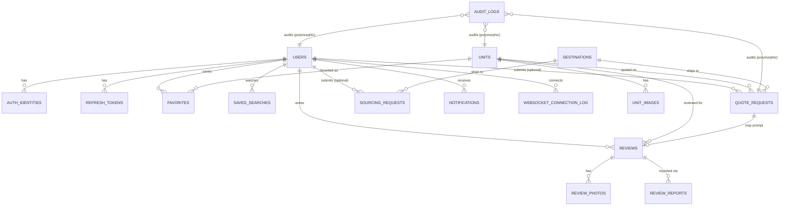

# M.A.S & SONS Backend — Database Schema

**Status**: design doc — no migrations exist yet. This is the source of truth for the first
Alembic migration set.
**Engine**: PostgreSQL 16+ (Cloud SQL) · **ORM**: SQLAlchemy 2 (sync) · **Migrations**: Alembic
**Builds on**: `sharedinfrastructure.md`, `emailsubsystem.md`, `notificationssubsystem.md`,
`websocketsubsystem.md` — those docs already specify `email_logs`, `notifications` and
`notification_preferences` in full; they're referenced here for the ERD but not redefined.

Confirmed scope for this schema (from the project decisions this doc was built against):

| Decision | Scope |
|---|---|
| Auction sourcing | Concierge-only. No `auction_lots`/`bids`/`bid_deposits` — "Request a Car" is a human-mediated inquiry. |
| Real-time | Ships at launch. Connection *audit* is persisted (below); the live connection registry itself stays in-memory + Redis, per `websocketsubsystem.md` — that design doesn't change. |
| Reviews | Buyer-submitted, with photos and moderation — not curated-only. |
| Buyer auth | Multi-provider: password, Google OAuth, and passwordless email login all available on the same account, with rotating refresh tokens. |

## Conventions

- **Primary keys**: `BIGSERIAL`, except where a value naturally needs to be unguessable
  (magic-link/refresh tokens use a random token, hashed before storage — never the PK).
- **Timestamps**: `TIMESTAMPTZ`, never bare `TIMESTAMP` — this business ships to buyers across many
  time zones and has a Japan-side domestic flow in a different zone again; naive timestamps would be
  a correctness bug waiting to happen the first time someone compares across the two.
- **Money**: `NUMERIC(12,2)`, never `FLOAT`/`DOUBLE` — binary float cannot represent currency
  exactly. Every price in this system is USD; there is no multi-currency requirement today, so no
  currency column is carried on every row — if that changes, it's an additive migration, not a
  redesign.
- **Soft delete**: only on tables that are authoritative records a person might reasonably ask to
  have deleted (`users`) or that the business needs an audit trail for even after removal
  (`units`). Event-projection tables (`notifications`, `email_logs`, `websocket_connection_log`) are
  hard-deleted by retention instead — recreating that record from an event log makes no sense, so
  soft-delete there would only be dead weight on every query.
- **Guest contact fields**: `quote_requests`, `sourcing_requests` and `buyback_leads` each carry the
  shared `GuestContact` shape as columns (`sharedinfrastructure.md` §5) — `contact_email`,
  `contact_whatsapp`, `user_id NULL`— rather than three independently-designed variants.

## Entity relationship overview



`notifications`, `notification_preferences`, `email_logs` attach to `users` the same way (nullable
`user_id`/`recipient_id` for guest-triggered rows) but are omitted from this diagram since they're
fully specified in their own docs.

---

## 1. Identity & auth

### `users`

```sql
CREATE TABLE users (
    id               BIGSERIAL PRIMARY KEY,
    email            CITEXT NOT NULL UNIQUE,          -- case-insensitive comparison, still case-preserving storage
    email_verified_at TIMESTAMPTZ,
    full_name        TEXT NOT NULL,
    phone            TEXT,
    user_type        TEXT NOT NULL CHECK (user_type IN ('buyer', 'staff')),
    staff_role       TEXT CHECK (staff_role IN ('admin', 'stock_manager', 'sales')),  -- NULL for buyers
    status           TEXT NOT NULL DEFAULT 'active' CHECK (status IN ('active', 'suspended', 'deleted')),
    timezone         TEXT NOT NULL DEFAULT 'UTC',      -- IANA name; used by notification quiet-hours
    locale           TEXT NOT NULL DEFAULT 'en',
    created_at       TIMESTAMPTZ NOT NULL DEFAULT now(),
    updated_at       TIMESTAMPTZ NOT NULL DEFAULT now(),
    deleted_at       TIMESTAMPTZ,                       -- soft delete: account-deletion requests need an audit trail
    CONSTRAINT staff_role_requires_staff CHECK (staff_role IS NULL OR user_type = 'staff')
);

CREATE UNIQUE INDEX idx_users_email ON users (email) WHERE deleted_at IS NULL;
CREATE INDEX idx_users_type_status ON users (user_type, status) WHERE deleted_at IS NULL;
```

Staff permissions are a small fixed enum (`staff_role`), not a dynamic roles/permissions graph —
this business has a handful of staff, not an organization large enough for that flexibility to earn
its complexity. If that ever changes, promoting `staff_role` to a proper `roles`/`permissions`
join is an additive migration, not a rewrite of anything that reads it (every check is already
`staff_role = 'x'`-shaped, which becomes `has_permission('x')`-shaped later without touching the
call sites' meaning).

### `auth_identities` — one user, multiple sign-in methods

```sql
CREATE TABLE auth_identities (
    id               BIGSERIAL PRIMARY KEY,
    user_id          BIGINT NOT NULL REFERENCES users(id) ON DELETE CASCADE,
    provider         TEXT NOT NULL CHECK (provider IN ('password', 'google', 'magic_link')),
    provider_subject TEXT,               -- Google's `sub` claim; NULL for password/magic_link
    password_hash    TEXT,               -- argon2id; NULL unless provider = 'password'
    created_at       TIMESTAMPTZ NOT NULL DEFAULT now(),
    last_used_at     TIMESTAMPTZ,
    CONSTRAINT one_identity_per_provider UNIQUE (user_id, provider),
    CONSTRAINT password_hash_only_for_password CHECK (
        (provider = 'password' AND password_hash IS NOT NULL) OR
        (provider != 'password' AND password_hash IS NULL)
    )
);

CREATE UNIQUE INDEX idx_auth_identities_google_subject ON auth_identities (provider_subject)
    WHERE provider = 'google';
```

A buyer can sign up with Google, later set a password on the same account, or log in passwordlessly
via a magic link — all three point at the same `user_id`, which is the actual "industry-professional"
part of this: authentication method is a property of *how you proved it's you today*, not a
property baked into the account at signup.

### `magic_link_tokens` — passwordless login

```sql
CREATE TABLE magic_link_tokens (
    id           BIGSERIAL PRIMARY KEY,
    email        CITEXT NOT NULL,
    token_hash   TEXT NOT NULL UNIQUE,     -- SHA-256 of the token; the raw token is only ever in the emailed link
    purpose      TEXT NOT NULL CHECK (purpose IN ('login', 'verify_email')),
    expires_at   TIMESTAMPTZ NOT NULL,     -- short TTL, e.g. now() + 15 minutes at issuance
    consumed_at  TIMESTAMPTZ,
    ip_address   INET,
    created_at   TIMESTAMPTZ NOT NULL DEFAULT now()
);

CREATE INDEX idx_magic_link_tokens_email ON magic_link_tokens (email) WHERE consumed_at IS NULL;
```

The raw token is emailed to the buyer and never stored — only its hash. A lookup hashes the
incoming token and compares against `token_hash`, checks `expires_at > now()` and
`consumed_at IS NULL`, then marks it consumed. This is the same shape as a password reset flow and
reuses the same table/purpose enum rather than a second one-off table.

### `refresh_tokens` — rotation with reuse detection

```sql
CREATE TABLE refresh_tokens (
    id                 BIGSERIAL PRIMARY KEY,
    user_id            BIGINT NOT NULL REFERENCES users(id) ON DELETE CASCADE,
    token_hash         TEXT NOT NULL UNIQUE,
    family_id          UUID NOT NULL,        -- shared across a chain of rotations from one login
    replaced_by_id     BIGINT REFERENCES refresh_tokens(id),
    expires_at         TIMESTAMPTZ NOT NULL,
    revoked_at         TIMESTAMPTZ,
    user_agent         TEXT,
    ip_address         INET,
    created_at         TIMESTAMPTZ NOT NULL DEFAULT now()
);

CREATE INDEX idx_refresh_tokens_user ON refresh_tokens (user_id) WHERE revoked_at IS NULL;
CREATE INDEX idx_refresh_tokens_family ON refresh_tokens (family_id);
```

Access tokens are short-lived JWTs (not persisted — verified by signature). Refresh tokens rotate
on every use: using one issues a new one in the same `family_id` and sets `replaced_by_id`. If a
refresh token is presented that's already been replaced, the entire `family_id` is revoked
immediately — that pattern is what makes a stolen-and-reused refresh token detectable rather than
silently granting the thief a valid session alongside the real user's.

---

## 2. Stock catalog

### `units`

```sql
CREATE TABLE units (
    id                 BIGSERIAL PRIMARY KEY,
    slug               TEXT NOT NULL UNIQUE,
    category           TEXT NOT NULL CHECK (category IN ('vehicle', 'equipment')),
    make               TEXT NOT NULL,
    model              TEXT NOT NULL,
    year               SMALLINT NOT NULL,
    price_usd          NUMERIC(12,2) NOT NULL CHECK (price_usd > 0),
    port               TEXT NOT NULL,             -- FOB loading port, e.g. "Yokohama"
    mileage_km         INTEGER CHECK (mileage_km IS NULL OR mileage_km >= 0),   -- vehicles only
    operating_hours    INTEGER CHECK (operating_hours IS NULL OR operating_hours >= 0), -- equipment only
    steering_position  TEXT CHECK (steering_position IN ('LHD', 'RHD')),         -- vehicles only
    auction_grade      TEXT NOT NULL CHECK (auction_grade IN ('5','4.5','4','3.5','3','R','RA')),
    repair_history     BOOLEAN NOT NULL DEFAULT FALSE,   -- 修復歴
    chassis_number     TEXT NOT NULL,
    engine             TEXT,
    displacement_cc    INTEGER,
    fuel_type          TEXT,
    transmission       TEXT,
    description        TEXT NOT NULL,
    status             TEXT NOT NULL DEFAULT 'in_stock' CHECK (status IN ('in_stock', 'sold', 'sourcing')),
    created_at         TIMESTAMPTZ NOT NULL DEFAULT now(),
    updated_at         TIMESTAMPTZ NOT NULL DEFAULT now(),
    deleted_at         TIMESTAMPTZ                 -- soft delete: a sold/removed unit's history stays queryable
);

CREATE INDEX idx_units_status_category ON units (status, category) WHERE deleted_at IS NULL;
CREATE INDEX idx_units_make_model ON units (make, model) WHERE deleted_at IS NULL;
CREATE INDEX idx_units_grade ON units (auction_grade) WHERE deleted_at IS NULL;
CREATE INDEX idx_units_price ON units (price_usd) WHERE deleted_at IS NULL AND status = 'in_stock';
```

One table for both catalogs (`category` discriminates), matching the Feature Audit's "two co-equal
catalogs, same underlying model" framing — a separate `vehicles`/`equipment` table pair would just
duplicate every shared column (price, grade, chassis, port) and force every cross-catalog query
(the homepage's stock-split donut, the combined search) into a `UNION`.

### `unit_images`

```sql
CREATE TABLE unit_images (
    id          BIGSERIAL PRIMARY KEY,
    unit_id     BIGINT NOT NULL REFERENCES units(id) ON DELETE CASCADE,
    url         TEXT NOT NULL,
    alt_text    TEXT,
    sort_order  SMALLINT NOT NULL DEFAULT 0,
    created_at  TIMESTAMPTZ NOT NULL DEFAULT now()
);

CREATE INDEX idx_unit_images_unit ON unit_images (unit_id, sort_order);
```

### `audit_logs` — system-wide, one row per action, not per field

```sql
CREATE TABLE audit_logs (
    id              BIGSERIAL PRIMARY KEY,
    entity_type     TEXT NOT NULL CHECK (entity_type IN (
                        'unit', 'quote_request', 'sourcing_request', 'buyback_lead', 'review', 'user'
                    )),
    entity_id       BIGINT NOT NULL,
    action          TEXT NOT NULL CHECK (action IN ('create', 'update', 'delete')),
    changed_fields  JSONB,          -- {"price_usd": {"old": "28500.00", "new": "27000.00"}, "status": {"old": "in_stock", "new": "sold"}}
    actor_type      TEXT NOT NULL CHECK (actor_type IN ('staff', 'system', 'buyer')),
    actor_user_id   BIGINT REFERENCES users(id) ON DELETE SET NULL,
    ip_address      INET,
    created_at      TIMESTAMPTZ NOT NULL DEFAULT now()
) PARTITION BY RANGE (created_at);

CREATE INDEX idx_audit_logs_entity ON audit_logs (entity_type, entity_id, created_at DESC);
CREATE INDEX idx_audit_logs_actor  ON audit_logs (actor_user_id, created_at DESC) WHERE actor_user_id IS NOT NULL;
CREATE INDEX idx_audit_logs_fields_gin ON audit_logs USING gin (changed_fields);
```

**One row per action, not per field.** Editing a unit's price and status in the same save is one
audit row with both diffs in `changed_fields`, not two disconnected rows that have to be
reassembled by matching timestamps — that reassembly is exactly the kind of thing that goes subtly
wrong under concurrent edits. The GIN index on `changed_fields` still makes "every price change
across every unit" a real, indexable query (`changed_fields ? 'price_usd'`), so nothing is given up
by not having a dedicated `field` column.

**What's actually audited, and why the list stops here:**

| Entity | Audited actions |
|---|---|
| `units` | Any field change, status transitions, soft-delete — the core "what did staff change on a live listing" trail. |
| `quote_requests` | Status transitions, and specifically `quoted_price_usd` being set — the one number a dispute would hinge on. |
| `sourcing_requests` | Status transitions. |
| `buyback_leads` | Status transitions — staff contact history with a domestic seller. |
| `reviews` | Moderation decisions (`approved`/`rejected`) — who approved or suppressed a public review, and when. |
| `users` | `staff_role` and `status` changes only — a staff account being promoted, demoted, or suspended is a security-relevant event worth a permanent trail. Buyer profile edits (name, phone) are not audited; they're the buyer's own data, not a compliance-relevant change. |

Deliberately **not** audited: `favorites`, `saved_searches`, and any other purely buyer-preference
data. Auditing those would be logging volume for its own sake — nobody on staff needs a change
history for "a buyer un-favorited a van." Auditing everything indiscriminately is as much a design
failure as auditing nothing — it buries the entries that actually matter under ones that don't and
inflates a table that's already designed to grow into the millions for real reasons.

`actor_type = 'system'` covers actions no human triggered directly — e.g. a future scheduled job
that marks a long-stale `sourcing_request` as `closed`. Keeping that distinct from `'staff'` means a
compliance review of "what did our staff actually do" isn't polluted by automation, and vice versa.

Partitioned by month via the same `Core.jobs.partitioning` utility as `email_logs`/`notifications`
(`sharedinfrastructure.md` §4/§6) — this table accumulates indefinitely the same way those do, for
the same reason, and now covers meaningfully more write volume than the units-only version did.

---

## 3. Lead generation

### `quote_requests`

```sql
CREATE TABLE quote_requests (
    id                BIGSERIAL PRIMARY KEY,
    unit_id           BIGINT NOT NULL REFERENCES units(id),
    user_id           BIGINT REFERENCES users(id),          -- NULL for guest submissions
    contact_email     CITEXT NOT NULL,
    contact_whatsapp  TEXT,
    destination_country CHAR(2) NOT NULL REFERENCES destinations(country_code),
    incoterm          TEXT NOT NULL CHECK (incoterm IN ('FOB', 'CFR', 'CIF')),
    status            TEXT NOT NULL DEFAULT 'pending' CHECK (status IN ('pending', 'quoted', 'closed')),
    quoted_price_usd  NUMERIC(12,2),
    quoted_at         TIMESTAMPTZ,
    notes             TEXT,
    created_at        TIMESTAMPTZ NOT NULL DEFAULT now(),
    updated_at        TIMESTAMPTZ NOT NULL DEFAULT now()
);

CREATE INDEX idx_quote_requests_unit ON quote_requests (unit_id);
CREATE INDEX idx_quote_requests_user ON quote_requests (user_id) WHERE user_id IS NOT NULL;
CREATE INDEX idx_quote_requests_status ON quote_requests (status, created_at DESC);
```

### `sourcing_requests` — "Request a Car"

```sql
CREATE TABLE sourcing_requests (
    id                  BIGSERIAL PRIMARY KEY,
    user_id             BIGINT REFERENCES users(id),
    contact_email       CITEXT NOT NULL,
    contact_whatsapp    TEXT,
    make                TEXT,
    model_description   TEXT NOT NULL,       -- free text: "Land Cruiser Prado, 2019 or newer"
    min_auction_grade   TEXT CHECK (min_auction_grade IN ('5','4.5','4','3.5','3','R','RA')),
    budget_max_usd      NUMERIC(12,2),
    destination_country CHAR(2) REFERENCES destinations(country_code),
    quote_type          TEXT CHECK (quote_type IN ('FOB', 'CFR', 'CIF')),
    buying_timeframe     TEXT,                -- free text, e.g. "within 30 days"
    status              TEXT NOT NULL DEFAULT 'pending' CHECK (status IN ('pending', 'sourcing', 'found', 'closed')),
    created_at          TIMESTAMPTZ NOT NULL DEFAULT now(),
    updated_at          TIMESTAMPTZ NOT NULL DEFAULT now()
);

CREATE INDEX idx_sourcing_requests_status ON sourcing_requests (status, created_at DESC);
```

Deliberately not a subtype of `quote_requests` sharing one table with a nullable `unit_id` — a
sourcing request has no unit to point at (that's the entire premise: nothing in stock matched), and
forcing it into the same table would mean every `quote_requests` query carries a `WHERE unit_id IS
NOT NULL` it doesn't otherwise need, or a confusing type discriminator on a table named for the
narrower case.

### `buyback_leads` — domestic (Japanese) sell-to-us leads

```sql
CREATE TABLE buyback_leads (
    id                       BIGSERIAL PRIMARY KEY,
    name                     TEXT NOT NULL,
    phone                    TEXT NOT NULL,
    vehicle_or_equipment_description TEXT NOT NULL,
    status                   TEXT NOT NULL DEFAULT 'new' CHECK (status IN ('new', 'contacted', 'closed')),
    created_at               TIMESTAMPTZ NOT NULL DEFAULT now()
);

CREATE TABLE buyback_lead_photos (
    id              BIGSERIAL PRIMARY KEY,
    buyback_lead_id BIGINT NOT NULL REFERENCES buyback_leads(id) ON DELETE CASCADE,
    url             TEXT NOT NULL,
    sort_order      SMALLINT NOT NULL DEFAULT 0
);
```

No `contact_email`/`user_id`/`GuestContact` columns here — this flow is explicitly LINE/phone-first
per the buyback page's own design (`RENDERING_AND_SEO_GUIDE.md`), not email-first, and it never
gets a buyer account. Modeling it with the same `GuestContact` shape as the two buyer-facing forms
would imply an email-centric flow this one deliberately isn't.

---

## 4. Buyer account features

### `favorites`

```sql
CREATE TABLE favorites (
    id         BIGSERIAL PRIMARY KEY,
    user_id    BIGINT NOT NULL REFERENCES users(id) ON DELETE CASCADE,
    unit_id    BIGINT NOT NULL REFERENCES units(id) ON DELETE CASCADE,
    created_at TIMESTAMPTZ NOT NULL DEFAULT now(),
    UNIQUE (user_id, unit_id)
);

CREATE INDEX idx_favorites_user ON favorites (user_id, created_at DESC);
```

### `saved_searches`

```sql
CREATE TABLE saved_searches (
    id              BIGSERIAL PRIMARY KEY,
    user_id         BIGINT NOT NULL REFERENCES users(id) ON DELETE CASCADE,
    name            TEXT,
    filters         JSONB NOT NULL,        -- the StockSearchParams shape, stored as-is
    alert_enabled   BOOLEAN NOT NULL DEFAULT TRUE,
    last_notified_at TIMESTAMPTZ,
    created_at      TIMESTAMPTZ NOT NULL DEFAULT now()
);

CREATE INDEX idx_saved_searches_alerts ON saved_searches (alert_enabled) WHERE alert_enabled = TRUE;
```

`filters` is JSONB rather than individual columns per filter field deliberately — a saved search's
shape mirrors the stock search UI's own filter set, which will grow over time (a new filter field
shouldn't need a migration on this table every time). The trade-off — JSONB can't be indexed as
cheaply as a real column per field — is fine here because saved searches are matched by a scheduled
job scanning `alert_enabled = TRUE` rows in bulk, not by a hot per-request query path.

---

## 5. Reviews & trust

### `reviews`

```sql
CREATE TABLE reviews (
    id                  BIGSERIAL PRIMARY KEY,
    user_id             BIGINT REFERENCES users(id),          -- NULL if a guest buyer's review (verified via quote_request)
    quote_request_id    BIGINT REFERENCES quote_requests(id), -- ties a review to a real completed transaction
    unit_id             BIGINT REFERENCES units(id),           -- denormalized for "reviews for this unit's category/make" queries
    reviewer_name        TEXT NOT NULL,
    destination_country  CHAR(2) REFERENCES destinations(country_code),
    rating              SMALLINT CHECK (rating BETWEEN 1 AND 5),
    body                TEXT NOT NULL,
    status              TEXT NOT NULL DEFAULT 'pending' CHECK (status IN ('pending', 'approved', 'rejected')),
    moderated_by_user_id BIGINT REFERENCES users(id),
    moderated_at        TIMESTAMPTZ,
    created_at          TIMESTAMPTZ NOT NULL DEFAULT now()
);

CREATE INDEX idx_reviews_status ON reviews (status, created_at DESC);
CREATE INDEX idx_reviews_country ON reviews (destination_country) WHERE status = 'approved';
```

`quote_request_id` is the verification anchor — a review is worth more, and is far harder to
astroturf, when it's tied to a request that actually went through the system, rather than an
open "leave a review" form anyone can submit to. `rating` is optional and secondary: the Feature
Audit's own reasoning is that a country-segmented testimonial ("bought from M.A.S & SONS, delivered
to Mombasa") is a stronger trust signal than a star average — the schema supports showing a rating
where given, without making the whole review system revolve around one.

### `review_photos`

```sql
CREATE TABLE review_photos (
    id         BIGSERIAL PRIMARY KEY,
    review_id  BIGINT NOT NULL REFERENCES reviews(id) ON DELETE CASCADE,
    url        TEXT NOT NULL,
    sort_order SMALLINT NOT NULL DEFAULT 0
);
```

### `review_reports` — abuse reporting

```sql
CREATE TABLE review_reports (
    id             BIGSERIAL PRIMARY KEY,
    review_id      BIGINT NOT NULL REFERENCES reviews(id) ON DELETE CASCADE,
    reporter_email CITEXT,
    reason         TEXT NOT NULL,
    resolved_at    TIMESTAMPTZ,
    created_at     TIMESTAMPTZ NOT NULL DEFAULT now()
);

CREATE INDEX idx_review_reports_unresolved ON review_reports (review_id) WHERE resolved_at IS NULL;
```

A reported-but-not-yet-resolved review stays visible by default (`reviews.status` is unaffected by
an open report) — a report only hides the review if staff act on it and set `status = 'rejected'`.
Auto-hiding on report count would itself be an abuse vector (report a genuine negative review
enough times to suppress it).

---

## 6. Real-time — connection audit (not the live registry)

The live `ConnectionManager` registry stays in-memory + Redis, exactly as `websocketsubsystem.md`
specifies — that doesn't change. What's persisted here is an **audit trail** of connection activity,
useful for debugging and security review, not a source of truth for "who's currently connected."

```sql
CREATE TABLE websocket_connection_log (
    id               BIGSERIAL PRIMARY KEY,
    connection_id    UUID NOT NULL,             -- matches the in-memory ConnectionManager's id for this connection
    user_id          BIGINT REFERENCES users(id) ON DELETE SET NULL,
    role             TEXT NOT NULL CHECK (role IN ('buyer', 'staff')),
    connected_at     TIMESTAMPTZ NOT NULL,
    disconnected_at  TIMESTAMPTZ,
    disconnect_reason TEXT,                      -- 'client_close' | 'idle_timeout' | 'server_shutdown' | 'error'
    ip_address       INET,
    instance_id      TEXT NOT NULL,               -- which Cloud Run instance handled this connection
    created_at       TIMESTAMPTZ NOT NULL DEFAULT now()
) PARTITION BY RANGE (created_at);

CREATE INDEX idx_ws_log_user ON websocket_connection_log (user_id, connected_at DESC);
CREATE INDEX idx_ws_log_open ON websocket_connection_log (connection_id) WHERE disconnected_at IS NULL;
```

Written once on connect (`disconnected_at` NULL) and updated once on disconnect — two writes per
connection lifetime, not a row per message, which is what keeps this table's growth proportional to
connection churn rather than message volume. Partitioned by month via the same shared utility as
every other log-shaped table in this system.

---

## 7. Shipping / destinations

### `destinations`

```sql
CREATE TABLE destinations (
    country_code            CHAR(2) PRIMARY KEY,     -- ISO 3166-1 alpha-2
    country_name            TEXT NOT NULL,
    primary_port            TEXT NOT NULL,
    origin_port              TEXT NOT NULL,            -- 'Yokohama' | 'Nagoya'
    estimated_transit_days  SMALLINT,
    shipping_mode           TEXT CHECK (shipping_mode IN ('roro', 'container', 'both')),
    import_regulations_summary TEXT,                    -- held back per the earlier feature-audit gap review:
                                                          -- populate only with real, client- or counsel-verified
                                                          -- per-country data, never a plausible-sounding guess
    updated_at              TIMESTAMPTZ NOT NULL DEFAULT now()
);
```

This is the table every destination landing page (`/destinations/[country]`), the homepage shipping
map, and both `quote_requests.destination_country`/`sourcing_requests.destination_country` FK
against. `import_regulations_summary` is nullable and starts empty for every row — filling it in is
a content task requiring real per-country research, not a schema task, and shipping placeholder
regulatory text would be actively harmful (a buyer relying on wrong import-age-limit information is
a real-world consequence, not a cosmetic bug).

---

## 8. Enum summary

For reference — every `CHECK ... IN (...)` constraint above, in one place:

| Column | Values |
|---|---|
| `users.user_type` | `buyer`, `staff` |
| `users.staff_role` | `admin`, `stock_manager`, `sales` |
| `users.status` | `active`, `suspended`, `deleted` |
| `auth_identities.provider` | `password`, `google`, `magic_link` |
| `magic_link_tokens.purpose` | `login`, `verify_email` |
| `units.category` | `vehicle`, `equipment` |
| `units.steering_position` | `LHD`, `RHD` |
| `units.auction_grade` | `5`, `4.5`, `4`, `3.5`, `3`, `R`, `RA` |
| `units.status` | `in_stock`, `sold`, `sourcing` |
| `quote_requests.incoterm` / `sourcing_requests.quote_type` | `FOB`, `CFR`, `CIF` |
| `quote_requests.status` | `pending`, `quoted`, `closed` |
| `sourcing_requests.status` | `pending`, `sourcing`, `found`, `closed` |
| `buyback_leads.status` | `new`, `contacted`, `closed` |
| `reviews.status` | `pending`, `approved`, `rejected` |
| `websocket_connection_log.role` | `buyer`, `staff` |
| `destinations.shipping_mode` | `roro`, `container`, `both` |

Plain `TEXT` + `CHECK` rather than native `ENUM` types throughout — adding a value to a `CHECK`
constraint is a simple, fast migration; adding a value to a Postgres native enum type has real
historical footguns (can't run in the same transaction as its use in older Postgres, ordering
quirks). At this system's write volume the marginal storage/comparison cost of `TEXT` over `ENUM` is
not a real consideration.

## 9. Cross-references

- `notifications`, `notification_preferences` — fully specified in `notificationssubsystem.md` §6,
  FK `recipient_id → users(id)`.
- `email_logs` — fully specified in `emailsubsystem.md` §5, FK `user_id → users(id) ON DELETE SET NULL`.
- Partitioning mechanics (`email_logs`, `notifications`, `audit_logs`, `websocket_connection_log`) —
  all four now share one implementation, `sharedinfrastructure.md` §4/§6.
