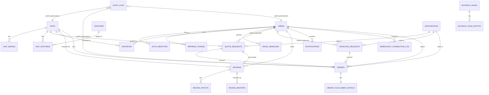

# M.A.S & SONS Backend — Database Schema

**Status**: design doc — no migrations exist yet. This is the source of truth for the first Alembic migration set. `MAS_SONS_Database_Schema_BigPicture.xlsx` is the visual, single-sheet quick-reference (schema block + realistic sample data per table, domain- and phase-grouped index) — this document carries the full SQL DDL, every index and table-level constraint inline per table, the complete Enum Summary (§11), and the narrative reasoning the workbook's format doesn't carry.

**Engine**: PostgreSQL 16+ (Cloud SQL) · **ORM**: SQLAlchemy 2 (sync `Session`) · **Migrations**: Alembic

**Builds on**: `sharedinfrastructure.md`, `emailsubsystem.md`, `notificationssubsystem.md`, `websocketsubsystem.md` — those docs already specify `email_logs`, `notifications` and `notification_preferences` in full; they're referenced here for the ERD but not redefined.

Confirmed scope for this schema (from the project decisions this doc was built against):

| Decision | Scope |
|---|---|
| Auction sourcing | Concierge-only. No `auction_lots`/`bids`/`bid_deposits` — "Request a Car" is a human-mediated inquiry. |
| Real-time | Ships at launch. Connection *audit* is persisted (`websocket_connection_log`); the live connection registry itself stays in-memory + Redis, per `websocketsubsystem.md` — that design doesn't change. |
| Reviews | Buyer-submitted, with photos and moderation — not curated-only. |
| Buyer auth | Multi-provider: password, Google OAuth, and passwordless email login all available on the same account, with rotating refresh tokens. |
| Orders & fulfillment | A converted quote/sourcing request becomes an `orders` row with commercial terms and shipment-milestone tracking. Identity verification and shipping-address collection happen only at this point — never at signup, never at quote stage — per the Feature Audit's own stated flow, and live in a separate `order_fulfillment_details` table so identity-document access can be scoped more tightly later. |
| Comparison tool | Deliberately **not modeled server-side**. The Feature Audit describes a simple client-side compare tray (2-3 units, session-scoped) — persisting that in the database would be state with no query anyone needs to run against it. |

## Conventions

- **Primary keys**: BIGSERIAL everywhere, except values that must be unguessable (magic-link and refresh tokens use a random token, hashed before storage — never the PK). Single-database, non-distributed system (one company, one Postgres instance) — auto-increment is the simplest correct choice per the project's own database-design standard. No UUID/ULID overhead where a sequence is sufficient.
- **Timestamps**: TIMESTAMPTZ, never bare TIMESTAMP. Buyers span many time zones; the Japanese domestic buyback flow is in yet another zone. Naive timestamps are a correctness bug waiting to happen the first time two are compared across zones.
- **Money**: NUMERIC(12,2), never FLOAT/DOUBLE. Every price is USD; no currency column carried on every row today. Binary float cannot represent currency exactly. Adding a currency column later, if multi-currency is ever needed, is an additive migration, not a redesign.
- **Soft delete**: deleted_at + deleted_by on authoritative records a person might reasonably ask to have deleted (users) or that need an audit trail after removal (units, requests, orders, reviews, etc). Event-projection log tables (notifications, email_logs, audit_logs, websocket_connection_log) are hard-deleted by retention instead. Recreating an event-log record from its own log makes no sense — soft-delete there would be dead weight on every query against tables already sized to grow into the millions.
- **Guest contact fields**: quote_requests and sourcing_requests each carry the shared GuestContact shape (contact_name / contact_email / contact_whatsapp / nullable user_id) as columns, rather than two independently-designed variants. One recipient shape for notification dispatch, one mental model for both buyer-facing forms, instead of two that drift apart. `buyback_leads` deliberately does not — see its own section below — that flow is LINE/phone-first, not email-first.
- **Enums**: Plain TEXT + CHECK ... IN (...), not native PostgreSQL ENUM types. Adding a value to a CHECK constraint is a fast, simple migration. Native enum types have real historical footguns (can't alter in the same transaction as use in older Postgres, ordering quirks). At this system's write volume, TEXT vs ENUM storage/comparison cost is not a real consideration.
- **Polymorphic references**: source_entity_type/source_entity_id (notifications) and entity_type/entity_id (audit_logs) are deliberately not foreign keys. A single FK can't point at six different parent tables. The GIN index on the JSONB payload alongside these columns keeps ad hoc queries indexable without one FK per possible parent.
- **Naming**: snake_case throughout; a table name is plural (units, orders); a FK column is <parent_singular>_id (unit_id, user_id) except where a more specific name earns its keep (recipient_id, actor_user_id, moderated_by_user_id). Predictable naming is what makes 25 tables navigable without a lookup table for lookup tables.
- **One row per action, not per field**: audit_logs stores one row per audited action with a changed_fields JSONB diff, not one row per changed field. Editing a unit's price and status in the same save is one row with both diffs, not two rows that have to be reassembled by matching timestamps — reassembly is exactly the kind of thing that goes subtly wrong under concurrent edits.
- **Security — password/token storage**: Passwords hashed with argon2id (auth_identities.password_hash). Magic-link and refresh tokens store only a SHA-256 hash (token_hash); the raw token exists only in the emailed link / issued cookie, never at rest. A database read (backup, replica, breach) never yields a usable credential.
- **Security — identity documents**: order_fulfillment_details.identity_document_url references a signed-URL upload; there is no raw passport/ID-number column anywhere in the schema. The scan is the record. This shrinks what a database-only breach could ever expose, and matches the API Flow Guide's own signed-upload-URL exception to "the browser never talks to the backend directly."
- **Query hygiene**: Never SELECT * in application code; every list endpoint is paginated (StockSearchParams already carries page/limit); every FK column that participates in a hot query path has a matching index (see Relationships + Indexes sheets). The three anti-patterns the project's own database-design standard calls out by name — this schema and the service layer built on it should never reproduce them.

## Entity Relationship Overview



`notifications`, `notification_preferences`, `email_logs` attach to `users` the same way (nullable `user_id`/`recipient_id` for guest-triggered rows) but are omitted from this diagram since they're fully specified in their own docs.


---

## 1. Identity & Auth

### `users`

One row per person who can authenticate: buyers (optional account) and staff.

```sql
CREATE TABLE users (
    id                           BIGSERIAL PRIMARY KEY,
    email                        CITEXT NOT NULL,
    email_verified_at            TIMESTAMPTZ,
    full_name                    TEXT NOT NULL,
    phone                        TEXT,
    user_type                    TEXT NOT NULL CHECK (user_type IN ('buyer','staff')),
    staff_role                   TEXT CHECK (staff_role IN ('admin','stock_manager','sales')),
    status                       TEXT NOT NULL DEFAULT 'active' CHECK (status IN ('active','suspended','deleted')),
    timezone                     TEXT NOT NULL DEFAULT 'UTC',
    locale                       TEXT NOT NULL DEFAULT 'en',
    created_at                   TIMESTAMPTZ NOT NULL DEFAULT now(),
    updated_at                   TIMESTAMPTZ NOT NULL DEFAULT now(),
    deleted_at                   TIMESTAMPTZ,
    deleted_by                   BIGINT REFERENCES users(id),
    CONSTRAINT chk_users_staff_role_requires_staff CHECK (staff_role IS NULL OR user_type = 'staff')
);

CREATE UNIQUE INDEX idx_users_email ON users (email) WHERE deleted_at IS NULL;
CREATE INDEX idx_users_type_status ON users (user_type, status) WHERE deleted_at IS NULL;
```

`staff_role` is a small fixed enum, not a roles/permissions graph — proportionate to a handful of internal staff.

**Table-level constraints:**

- `staff_role_requires_staff`: `CHECK (staff_role IS NULL OR user_type = 'staff')` — A buyer can never carry a staff_role value.

### `auth_identities`

One row per sign-in method (password / Google / magic link) linked to a user — a buyer can hold several at once.

```sql
CREATE TABLE auth_identities (
    id                           BIGSERIAL PRIMARY KEY,
    user_id                      BIGINT NOT NULL REFERENCES users(id) ON DELETE CASCADE,
    provider                     TEXT NOT NULL CHECK (provider IN ('password','google','magic_link')),
    provider_subject             TEXT,
    password_hash                TEXT,
    created_at                   TIMESTAMPTZ NOT NULL DEFAULT now(),
    updated_at                   TIMESTAMPTZ NOT NULL DEFAULT now(),
    last_used_at                 TIMESTAMPTZ,
    deleted_at                   TIMESTAMPTZ,
    deleted_by                   BIGINT REFERENCES users(id),
    CONSTRAINT chk_auth_identities_password_hash_only_for_password CHECK (
        (provider = 'password' AND password_hash IS NOT NULL) OR
        (provider != 'password' AND password_hash IS NULL)
    )
);

CREATE UNIQUE INDEX idx_auth_identities_google_subject ON auth_identities (provider_subject) WHERE provider = 'google';
CREATE UNIQUE INDEX uq_auth_identities_user_provider ON auth_identities (user_id, provider);
```

UNIQUE(user_id, provider) — one identity per provider per user, not a global unique on provider alone.

**Table-level constraints:**

- `one_identity_per_provider`: `UNIQUE (user_id, provider)` — A user has at most one password / one Google / one magic-link identity, not several of the same kind.
- `password_hash_only_for_password`: `CHECK ((provider='password' AND password_hash IS NOT NULL) OR (provider!='password' AND password_hash IS NULL))` — A Google or magic-link identity can never carry a password hash, and vice versa.

### `magic_link_tokens`

Single-use passwordless login / email-verification tokens.

```sql
CREATE TABLE magic_link_tokens (
    id                           BIGSERIAL PRIMARY KEY,
    email                        CITEXT NOT NULL,
    token_hash                   TEXT NOT NULL,
    purpose                      TEXT NOT NULL CHECK (purpose IN ('login','verify_email')),
    expires_at                   TIMESTAMPTZ NOT NULL,
    consumed_at                  TIMESTAMPTZ,
    ip_address                   INET,
    created_at                   TIMESTAMPTZ NOT NULL DEFAULT now()
);

CREATE INDEX idx_magic_link_tokens_email ON magic_link_tokens (email) WHERE consumed_at IS NULL;
CREATE UNIQUE INDEX uq_magic_link_tokens_token_hash ON magic_link_tokens (token_hash);
```

No soft delete — lifecycle is fully described by expires_at / consumed_at; a consumed or expired row is inert, not deleted.

### `refresh_tokens`

Rotating refresh tokens with reuse detection (token-family revocation).

```sql
CREATE TABLE refresh_tokens (
    id                           BIGSERIAL PRIMARY KEY,
    user_id                      BIGINT NOT NULL REFERENCES users(id) ON DELETE CASCADE,
    token_hash                   TEXT NOT NULL,
    family_id                    UUID NOT NULL,
    replaced_by_id               BIGINT REFERENCES refresh_tokens(id),
    expires_at                   TIMESTAMPTZ NOT NULL,
    revoked_at                   TIMESTAMPTZ,
    user_agent                   TEXT,
    ip_address                   INET,
    created_at                   TIMESTAMPTZ NOT NULL DEFAULT now()
);

CREATE INDEX idx_refresh_tokens_user ON refresh_tokens (user_id) WHERE revoked_at IS NULL;
CREATE INDEX idx_refresh_tokens_family ON refresh_tokens (family_id);
CREATE UNIQUE INDEX uq_refresh_tokens_token_hash ON refresh_tokens (token_hash);
```

No soft delete — lifecycle is expires_at / revoked_at / replaced_by_id.


---

## 2. Stock Catalog

### `units`

The stock catalog — one row per vehicle or equipment unit for sale. `category` discriminates; one table avoids UNION'ing two near-identical catalogs on every browse/search query.

```sql
CREATE TABLE units (
    id                           BIGSERIAL PRIMARY KEY,
    slug                         TEXT NOT NULL,
    category                     TEXT NOT NULL CHECK (category IN ('vehicle','equipment')),
    body_type                    TEXT NOT NULL,
    make                         TEXT NOT NULL,
    model                        TEXT NOT NULL,
    year                         SMALLINT NOT NULL,
    color                        TEXT,
    price_usd                    NUMERIC(12,2) NOT NULL CHECK (price_usd > 0),
    port                         TEXT NOT NULL,
    mileage_km                   INTEGER CHECK (mileage_km IS NULL OR mileage_km >= 0),
    operating_hours              INTEGER CHECK (operating_hours IS NULL OR operating_hours >= 0),
    steering_position            TEXT CHECK (steering_position IN ('LHD','RHD')),
    auction_grade                TEXT NOT NULL CHECK (auction_grade IN ('5','4.5','4','3.5','3','R','RA')),
    repair_history               BOOLEAN NOT NULL DEFAULT FALSE,
    one_owner                    BOOLEAN,
    auction_sheet_url            TEXT,
    chassis_number               TEXT NOT NULL,
    engine                       TEXT,
    displacement_cc              INTEGER,
    drivetrain                   TEXT,
    fuel_type                    TEXT,
    transmission                 TEXT,
    description                  TEXT NOT NULL,
    search_vector                TSVECTOR GENERATED ALWAYS AS (to_tsvector('english', make || ' ' || model || ' ' || description)) STORED,
    status                       TEXT NOT NULL DEFAULT 'in_stock' CHECK (status IN ('in_stock','sold','sourcing')),
    created_at                   TIMESTAMPTZ NOT NULL DEFAULT now(),
    updated_at                   TIMESTAMPTZ NOT NULL DEFAULT now(),
    deleted_at                   TIMESTAMPTZ,
    deleted_by                   BIGINT REFERENCES users(id)
);

CREATE INDEX idx_units_status_category ON units (status, category) WHERE deleted_at IS NULL;
CREATE INDEX idx_units_make_model ON units (make, model) WHERE deleted_at IS NULL;
CREATE INDEX idx_units_grade ON units (auction_grade) WHERE deleted_at IS NULL;
CREATE INDEX idx_units_price ON units (price_usd) WHERE deleted_at IS NULL AND status = 'in_stock';
CREATE INDEX idx_units_search_vector ON units USING gin (search_vector);
CREATE UNIQUE INDEX uq_units_slug ON units (slug) WHERE deleted_at IS NULL;
```

Full-text search via a generated `search_vector` column (see Indexes) serves the Feature Audit's free-text keyword search requirement without a search-engine dependency at this catalog size.

**Table-level constraints:**

- `chk_units_price_positive`: `CHECK (price_usd > 0)` — A listed price of zero or negative is always a data error, never a real business state.
- `chk_units_mileage_nonneg`: `CHECK (mileage_km IS NULL OR mileage_km >= 0)` — Vehicles only; NULL for equipment.
- `chk_units_hours_nonneg`: `CHECK (operating_hours IS NULL OR operating_hours >= 0)` — Equipment only; NULL for vehicles.

### `unit_images`

Photo gallery per unit, including the trust-critical odometer photo.

```sql
CREATE TABLE unit_images (
    id                           BIGSERIAL PRIMARY KEY,
    unit_id                      BIGINT NOT NULL REFERENCES units(id) ON DELETE CASCADE,
    url                          TEXT NOT NULL,
    photo_type                   TEXT NOT NULL DEFAULT 'exterior' CHECK (photo_type IN ('exterior','interior','engine_bay','undercarriage','odometer','other')),
    alt_text                     TEXT,
    sort_order                   SMALLINT NOT NULL DEFAULT 0,
    created_at                   TIMESTAMPTZ NOT NULL DEFAULT now(),
    updated_at                   TIMESTAMPTZ NOT NULL DEFAULT now(),
    deleted_at                   TIMESTAMPTZ,
    deleted_by                   BIGINT REFERENCES users(id)
);

CREATE INDEX idx_unit_images_unit ON unit_images (unit_id, sort_order) WHERE deleted_at IS NULL;
```

`photo_type` lets the UI guarantee an odometer shot and undercarriage/engine-bay coverage are present, not just a pile of undifferentiated images.

### `features`

Controlled vocabulary of options/equipment (e.g. 'Air Conditioning', 'Power Steering') — the Feature Audit's 'structured options/equipment list'.

```sql
CREATE TABLE features (
    id                           BIGSERIAL PRIMARY KEY,
    name                         TEXT NOT NULL,
    category                     TEXT NOT NULL CHECK (category IN ('comfort','safety','exterior','mechanical','equipment_attachment')),
    applies_to                   TEXT NOT NULL DEFAULT 'both' CHECK (applies_to IN ('vehicle','equipment','both')),
    created_at                   TIMESTAMPTZ NOT NULL DEFAULT now(),
    updated_at                   TIMESTAMPTZ NOT NULL DEFAULT now(),
    deleted_at                   TIMESTAMPTZ,
    deleted_by                   BIGINT REFERENCES users(id)
);

CREATE UNIQUE INDEX uq_features_name ON features (name) WHERE deleted_at IS NULL;
CREATE INDEX idx_features_category ON features (category, applies_to) WHERE deleted_at IS NULL;
```

A lookup table, not free text, so the same feature is never spelled three different ways across units.

### `unit_features`

Many-to-many: which features apply to which unit.

```sql
CREATE TABLE unit_features (
    unit_id                      BIGINT NOT NULL REFERENCES units(id) ON DELETE CASCADE,
    feature_id                   BIGINT NOT NULL REFERENCES features(id) ON DELETE CASCADE,
    created_at                   TIMESTAMPTZ NOT NULL DEFAULT now(),
    deleted_at                   TIMESTAMPTZ,
    deleted_by                   BIGINT REFERENCES users(id),
    PRIMARY KEY (unit_id, feature_id)
);

CREATE INDEX idx_unit_features_feature ON unit_features (feature_id);
```

Composite PK (unit_id, feature_id). Re-confirming a retracted feature restores the existing soft-deleted row (UPDATE deleted_at = NULL) rather than inserting a duplicate — the PK does not special-case deleted_at.

**Table-level constraints:**

- `pk_unit_features`: `PRIMARY KEY (unit_id, feature_id)` — Composite PK — a feature applies to a unit at most once; retracting and reconfirming reuses the same row.


---

## 3. Lead Generation & Orders

### `quote_requests`

'Get a Quote' — a buyer or guest asks for a delivered price on a specific unit.

```sql
CREATE TABLE quote_requests (
    id                           BIGSERIAL PRIMARY KEY,
    unit_id                      BIGINT NOT NULL REFERENCES units(id),
    user_id                      BIGINT REFERENCES users(id),
    contact_name                 TEXT NOT NULL,
    contact_email                CITEXT NOT NULL,
    contact_whatsapp             TEXT,
    destination_country          CHAR(2) NOT NULL REFERENCES destinations(country_code),
    incoterm                     TEXT NOT NULL CHECK (incoterm IN ('FOB','CFR','CIF')),
    status                       TEXT NOT NULL DEFAULT 'pending' CHECK (status IN ('pending','quoted','closed')),
    quoted_price_usd             NUMERIC(12,2),
    quoted_at                    TIMESTAMPTZ,
    notes                        TEXT,
    created_at                   TIMESTAMPTZ NOT NULL DEFAULT now(),
    updated_at                   TIMESTAMPTZ NOT NULL DEFAULT now(),
    deleted_at                   TIMESTAMPTZ,
    deleted_by                   BIGINT REFERENCES users(id)
);

CREATE INDEX idx_quote_requests_unit ON quote_requests (unit_id);
CREATE INDEX idx_quote_requests_user ON quote_requests (user_id) WHERE user_id IS NOT NULL;
CREATE INDEX idx_quote_requests_status ON quote_requests (status, created_at DESC);
```

Guest-allowed: user_id is nullable; contact_name/email/whatsapp follow the shared GuestContact shape used identically across both lead-gen forms (`sourcing_requests` is the other — `buyback_leads` deliberately does not, see its own section below).

### `sourcing_requests`

'Request a Car' — buyer describes what they want when nothing in stock matches; staff sources it via auction.

```sql
CREATE TABLE sourcing_requests (
    id                           BIGSERIAL PRIMARY KEY,
    user_id                      BIGINT REFERENCES users(id),
    contact_name                 TEXT NOT NULL,
    contact_email                CITEXT NOT NULL,
    contact_whatsapp             TEXT,
    make                         TEXT,
    model_description            TEXT NOT NULL,
    min_auction_grade            TEXT CHECK (min_auction_grade IN ('5','4.5','4','3.5','3','R','RA')),
    budget_max_usd               NUMERIC(12,2),
    destination_country          CHAR(2) REFERENCES destinations(country_code),
    quote_type                   TEXT CHECK (quote_type IN ('FOB','CFR','CIF')),
    buying_timeframe             TEXT,
    status                       TEXT NOT NULL DEFAULT 'pending' CHECK (status IN ('pending','sourcing','found','closed')),
    created_at                   TIMESTAMPTZ NOT NULL DEFAULT now(),
    updated_at                   TIMESTAMPTZ NOT NULL DEFAULT now(),
    deleted_at                   TIMESTAMPTZ,
    deleted_by                   BIGINT REFERENCES users(id)
);

CREATE INDEX idx_sourcing_requests_status ON sourcing_requests (status, created_at DESC);
CREATE INDEX idx_sourcing_requests_user ON sourcing_requests (user_id) WHERE user_id IS NOT NULL;
```

Deliberately not a nullable-unit_id row in quote_requests — a sourcing request has no unit to point at, and forcing the shared table would carry a WHERE unit_id IS NOT NULL every quote query doesn't need.

### `buyback_leads`

Domestic seller-facing 'sell to us' leads — name, phone, description, photos; no account, no email.

```sql
CREATE TABLE buyback_leads (
    id                           BIGSERIAL PRIMARY KEY,
    name                         TEXT NOT NULL,
    phone                        TEXT NOT NULL,
    vehicle_or_equipment_description TEXT NOT NULL,
    status                       TEXT NOT NULL DEFAULT 'new' CHECK (status IN ('new','contacted','closed')),
    created_at                   TIMESTAMPTZ NOT NULL DEFAULT now(),
    updated_at                   TIMESTAMPTZ NOT NULL DEFAULT now(),
    deleted_at                   TIMESTAMPTZ,
    deleted_by                   BIGINT REFERENCES users(id)
);

CREATE INDEX idx_buyback_leads_status ON buyback_leads (status, created_at DESC);
```

LINE/phone-first by design, per the buyback page's own reference design — not the GuestContact (email-first) shape used by the two buyer-facing forms.

### `buyback_lead_photos`

Photos attached to a domestic buyback lead.

```sql
CREATE TABLE buyback_lead_photos (
    id                           BIGSERIAL PRIMARY KEY,
    buyback_lead_id              BIGINT NOT NULL REFERENCES buyback_leads(id) ON DELETE CASCADE,
    url                          TEXT NOT NULL,
    sort_order                   SMALLINT NOT NULL DEFAULT 0,
    created_at                   TIMESTAMPTZ NOT NULL DEFAULT now(),
    deleted_at                   TIMESTAMPTZ,
    deleted_by                   BIGINT REFERENCES users(id)
);

CREATE INDEX idx_buyback_lead_photos_lead ON buyback_lead_photos (buyback_lead_id, sort_order);
```

### `orders`

A quote or sourcing request that converted into a real transaction — commercial terms, invoice, and shipment-milestone tracking.

```sql
CREATE TABLE orders (
    id                           BIGSERIAL PRIMARY KEY,
    quote_request_id             BIGINT REFERENCES quote_requests(id),
    sourcing_request_id          BIGINT REFERENCES sourcing_requests(id),
    unit_id                      BIGINT NOT NULL REFERENCES units(id),
    user_id                      BIGINT REFERENCES users(id),
    contact_name                 TEXT NOT NULL,
    contact_email                CITEXT NOT NULL,
    final_price_usd              NUMERIC(12,2) NOT NULL,
    incoterm                     TEXT NOT NULL CHECK (incoterm IN ('FOB','CFR','CIF')),
    destination_country          CHAR(2) NOT NULL REFERENCES destinations(country_code),
    invoice_number               TEXT,
    payment_status               TEXT NOT NULL DEFAULT 'pending_invoice' CHECK (payment_status IN ('pending_invoice','invoiced','paid')),
    shipping_status              TEXT NOT NULL DEFAULT 'pending' CHECK (shipping_status IN ('pending','booked','loaded','departed','arrived','customs_clearance','delivered')),
    shipping_status_updated_at   TIMESTAMPTZ,
    created_at                   TIMESTAMPTZ NOT NULL DEFAULT now(),
    updated_at                   TIMESTAMPTZ NOT NULL DEFAULT now(),
    deleted_at                   TIMESTAMPTZ,
    deleted_by                   BIGINT REFERENCES users(id),
    CONSTRAINT chk_orders_exactly_one_source CHECK (num_nonnulls(quote_request_id, sourcing_request_id) = 1)
);

CREATE INDEX idx_orders_user ON orders (user_id) WHERE user_id IS NOT NULL;
CREATE INDEX idx_orders_unit ON orders (unit_id);
CREATE UNIQUE INDEX uq_orders_quote_request ON orders (quote_request_id) WHERE quote_request_id IS NOT NULL;
CREATE UNIQUE INDEX uq_orders_sourcing_request ON orders (sourcing_request_id) WHERE sourcing_request_id IS NOT NULL;
CREATE UNIQUE INDEX uq_orders_invoice_number ON orders (invoice_number) WHERE invoice_number IS NOT NULL;
CREATE INDEX idx_orders_status ON orders (payment_status, shipping_status) WHERE deleted_at IS NULL;
```

CHECK (num_nonnulls(quote_request_id, sourcing_request_id) = 1) — an order always traces back to exactly one originating request. One order per source request is enforced by partial unique indexes on each FK, not the PK. `shipping_status` transitions are the trigger point for the stock.shipment_update notification and are what a buyer is anxiously refreshing for while their unit crosses an ocean.

**Table-level constraints:**

- `chk_orders_exactly_one_source`: `CHECK (num_nonnulls(quote_request_id, sourcing_request_id) = 1)` — An order always traces back to exactly one originating request — never both, never neither.

### `order_fulfillment_details`

Shipping address and identity-verification record, collected only once an order is actually placed (per the Feature Audit: no identity checks at signup or quote stage).

```sql
CREATE TABLE order_fulfillment_details (
    id                           BIGSERIAL PRIMARY KEY,
    order_id                     BIGINT NOT NULL REFERENCES orders(id) ON DELETE CASCADE,
    consignee_name               TEXT NOT NULL,
    consignee_phone              TEXT NOT NULL,
    shipping_address_line1       TEXT NOT NULL,
    shipping_address_line2       TEXT,
    shipping_city                TEXT NOT NULL,
    shipping_state_province      TEXT,
    shipping_postal_code         TEXT,
    identity_document_type       TEXT CHECK (identity_document_type IN ('passport','national_id','driver_license')),
    identity_document_url        TEXT,
    identity_verified_at         TIMESTAMPTZ,
    identity_verified_by         BIGINT REFERENCES users(id) ON DELETE SET NULL,
    created_at                   TIMESTAMPTZ NOT NULL DEFAULT now(),
    updated_at                   TIMESTAMPTZ NOT NULL DEFAULT now(),
    deleted_at                   TIMESTAMPTZ,
    deleted_by                   BIGINT REFERENCES users(id)
);

CREATE UNIQUE INDEX uq_order_fulfillment_order ON order_fulfillment_details (order_id);
CREATE INDEX idx_order_fulfillment_unverified ON order_fulfillment_details (order_id) WHERE identity_verified_at IS NULL;
```

Split out from `orders` (not extra columns on it) so identity-document access can be scoped more tightly than ordinary commercial/shipping data if a future column-level grant or row-level-security policy needs it. `identity_document_url` points at a signed-URL upload (per the API Flow Guide's binary-upload exception) — the raw passport/ID number itself is never a database column; the scan is the record, which shrinks what a database breach could ever expose.

**Table-level constraints:**

- `uq_order_fulfillment_order`: `UNIQUE (order_id)` — Enforces the 1:1 relationship with orders.


---

## 4. Buyer Account Features

### `favorites`

A buyer's saved/favorited units.

```sql
CREATE TABLE favorites (
    id                           BIGSERIAL PRIMARY KEY,
    user_id                      BIGINT NOT NULL REFERENCES users(id) ON DELETE CASCADE,
    unit_id                      BIGINT NOT NULL REFERENCES units(id) ON DELETE CASCADE,
    created_at                   TIMESTAMPTZ NOT NULL DEFAULT now(),
    deleted_at                   TIMESTAMPTZ,
    deleted_by                   BIGINT REFERENCES users(id)
);

CREATE INDEX idx_favorites_user ON favorites (user_id, created_at DESC);
CREATE UNIQUE INDEX uq_favorites_user_unit ON favorites (user_id, unit_id);
```

UNIQUE(user_id, unit_id) is table-wide, not partial on deleted_at — re-favoriting after an unfavorite restores the existing soft-deleted row rather than inserting a new one.

**Table-level constraints:**

- `uq_favorites_user_unit`: `UNIQUE (user_id, unit_id)` — Table-wide, not partial on deleted_at — see Data Dictionary note on the restore-on-refavorite pattern.

### `saved_searches`

A buyer's saved filter set with new-stock alerting.

```sql
CREATE TABLE saved_searches (
    id                           BIGSERIAL PRIMARY KEY,
    user_id                      BIGINT NOT NULL REFERENCES users(id) ON DELETE CASCADE,
    name                         TEXT,
    filters                      JSONB NOT NULL,
    alert_enabled                BOOLEAN NOT NULL DEFAULT TRUE,
    last_notified_at             TIMESTAMPTZ,
    created_at                   TIMESTAMPTZ NOT NULL DEFAULT now(),
    updated_at                   TIMESTAMPTZ NOT NULL DEFAULT now(),
    deleted_at                   TIMESTAMPTZ,
    deleted_by                   BIGINT REFERENCES users(id)
);

CREATE INDEX idx_saved_searches_alerts ON saved_searches (alert_enabled) WHERE alert_enabled = TRUE;
```

`filters` is JSONB mirroring StockSearchParams as-is — a new filter field never needs a migration here. Matched by a scheduled batch job scanning alert_enabled = TRUE, not a hot per-request path, so the JSONB is not a query-performance liability.


---

## 5. Reviews & Trust

### `reviews`

Buyer-submitted, country-segmented testimonials tied to a real quote request (the verification anchor).

```sql
CREATE TABLE reviews (
    id                           BIGSERIAL PRIMARY KEY,
    user_id                      BIGINT REFERENCES users(id),
    quote_request_id             BIGINT REFERENCES quote_requests(id),
    unit_id                      BIGINT REFERENCES units(id),
    reviewer_name                TEXT NOT NULL,
    destination_country          CHAR(2) REFERENCES destinations(country_code),
    rating                       SMALLINT CHECK (rating IS NULL OR rating BETWEEN 1 AND 5),
    body                         TEXT NOT NULL,
    status                       TEXT NOT NULL DEFAULT 'pending' CHECK (status IN ('pending','approved','rejected')),
    moderated_by_user_id         BIGINT REFERENCES users(id),
    moderated_at                 TIMESTAMPTZ,
    created_at                   TIMESTAMPTZ NOT NULL DEFAULT now(),
    updated_at                   TIMESTAMPTZ NOT NULL DEFAULT now(),
    deleted_at                   TIMESTAMPTZ,
    deleted_by                   BIGINT REFERENCES users(id)
);

CREATE INDEX idx_reviews_status ON reviews (status, created_at DESC);
CREATE INDEX idx_reviews_country ON reviews (destination_country) WHERE status = 'approved';
```

`rating` is optional and secondary — a country-segmented written testimonial is the stronger trust signal in this business than a star average.

**Table-level constraints:**

- `chk_reviews_rating_range`: `CHECK (rating BETWEEN 1 AND 5)` — Rating is optional (nullable) but bounded when present.

### `review_photos`

Photos attached to a buyer-submitted review.

```sql
CREATE TABLE review_photos (
    id                           BIGSERIAL PRIMARY KEY,
    review_id                    BIGINT NOT NULL REFERENCES reviews(id) ON DELETE CASCADE,
    url                          TEXT NOT NULL,
    sort_order                   SMALLINT NOT NULL DEFAULT 0,
    created_at                   TIMESTAMPTZ NOT NULL DEFAULT now(),
    deleted_at                   TIMESTAMPTZ,
    deleted_by                   BIGINT REFERENCES users(id)
);

CREATE INDEX idx_review_photos_review ON review_photos (review_id, sort_order);
```

### `review_reports`

Abuse/moderation reports against a published review.

```sql
CREATE TABLE review_reports (
    id                           BIGSERIAL PRIMARY KEY,
    review_id                    BIGINT NOT NULL REFERENCES reviews(id) ON DELETE CASCADE,
    reporter_email               CITEXT,
    reason                       TEXT NOT NULL,
    resolved_at                  TIMESTAMPTZ,
    created_at                   TIMESTAMPTZ NOT NULL DEFAULT now(),
    updated_at                   TIMESTAMPTZ NOT NULL DEFAULT now(),
    deleted_at                   TIMESTAMPTZ,
    deleted_by                   BIGINT REFERENCES users(id)
);

CREATE INDEX idx_review_reports_unresolved ON review_reports (review_id) WHERE resolved_at IS NULL;
```

A report never auto-hides the review — only staff acting on it (setting reviews.status = 'rejected') does. Auto-hiding on report count would itself be an abuse vector.


---

## 6. Notifications (see notificationssubsystem.md for the dispatch design)

### `notifications`

Fan-out-on-write in-app/email dispatch record, one row per recipient per notification event.

```sql
CREATE TABLE notifications (
    id                           BIGSERIAL PRIMARY KEY,
    recipient_type               TEXT NOT NULL CHECK (recipient_type IN ('user','staff')),
    recipient_id                 BIGINT NOT NULL REFERENCES users(id) ON DELETE CASCADE,
    notification_type            TEXT NOT NULL,
    category                     TEXT NOT NULL,
    priority                     TEXT NOT NULL CHECK (priority IN ('low','normal','high','critical')),
    title                        TEXT NOT NULL,
    body                         TEXT NOT NULL,
    action_url                   TEXT,
    source_entity_type           TEXT,
    source_entity_id             BIGINT,
    status                       TEXT NOT NULL DEFAULT 'unread' CHECK (status IN ('unread','read','archived')),
    read_at                      TIMESTAMPTZ,
    expires_at                   TIMESTAMPTZ,
    created_at                   TIMESTAMPTZ NOT NULL DEFAULT now()
) PARTITION BY RANGE (created_at);

CREATE INDEX idx_notifications_recipient_status ON notifications (recipient_id, status, created_at DESC);
CREATE INDEX idx_notifications_expires ON notifications (expires_at) WHERE expires_at IS NOT NULL;
```

No soft delete — an event projection, hard-deleted by retention once read/archived or once its partition ages out. Partitioned monthly; see Partitioning & Retention.

### `notification_preferences`

Per-user channel/quiet-hours/digest preferences.

```sql
CREATE TABLE notification_preferences (
    id                           BIGSERIAL PRIMARY KEY,
    user_id                      BIGINT NOT NULL REFERENCES users(id) ON DELETE CASCADE,
    channel_preferences          JSONB NOT NULL DEFAULT '{}'::jsonb,
    is_email_paused              BOOLEAN NOT NULL DEFAULT FALSE,
    marketing_opt_in             BOOLEAN NOT NULL DEFAULT FALSE,
    quiet_hours_start            TIME,
    quiet_hours_end              TIME,
    timezone                     TEXT NOT NULL DEFAULT 'UTC',
    digest_frequency             TEXT NOT NULL DEFAULT 'realtime' CHECK (digest_frequency IN ('realtime','daily','weekly','never')),
    created_at                   TIMESTAMPTZ NOT NULL DEFAULT now(),
    updated_at                   TIMESTAMPTZ NOT NULL DEFAULT now(),
    deleted_at                   TIMESTAMPTZ,
    deleted_by                   BIGINT REFERENCES users(id)
);

CREATE UNIQUE INDEX uq_notification_preferences_user ON notification_preferences (user_id);
```

Guest buyers never get a row — they receive only the transactional messages their own action triggered, with no opt-out surface to store.

**Table-level constraints:**

- `uq_notification_preferences_user`: `UNIQUE (user_id)` — Exactly one preference row per registered user.


---

## 7. Email (see emailsubsystem.md for the dispatch design)

### `email_logs`

One row per outbound email send attempt, mutated in place (queued → sending → sent/failed/retrying).

```sql
CREATE TABLE email_logs (
    id                           BIGSERIAL PRIMARY KEY,
    user_id                      BIGINT REFERENCES users(id) ON DELETE SET NULL,
    to_email                     TEXT NOT NULL,
    template_name                TEXT NOT NULL,
    subject                      TEXT NOT NULL,
    provider                     TEXT NOT NULL,
    status                       TEXT NOT NULL,
    provider_message_id          TEXT,
    error_code                   TEXT,
    error_message                TEXT,
    attempts                     SMALLINT NOT NULL DEFAULT 0,
    extra                        JSONB NOT NULL DEFAULT '{}'::jsonb,
    created_at                   TIMESTAMPTZ NOT NULL DEFAULT now()
) PARTITION BY RANGE (created_at);

CREATE INDEX idx_email_logs_to_email ON email_logs (to_email);
CREATE INDEX idx_email_logs_status ON email_logs (status) WHERE status IN ('queued','retrying');
CREATE INDEX idx_email_logs_user_created ON email_logs (user_id, created_at DESC);
CREATE INDEX idx_email_logs_extra_gin ON email_logs USING gin (extra);
```

No soft delete — an event projection. Partitioned monthly; see Partitioning & Retention.


---

## 8. Real-Time — Connection Audit

### `websocket_connection_log`

Audit trail of real-time connection activity — debugging and security review, not the live connection registry (that stays in-memory + Redis).

```sql
CREATE TABLE websocket_connection_log (
    id                           BIGSERIAL PRIMARY KEY,
    connection_id                UUID NOT NULL,
    user_id                      BIGINT REFERENCES users(id) ON DELETE SET NULL,
    role                         TEXT NOT NULL CHECK (role IN ('buyer','staff')),
    connected_at                 TIMESTAMPTZ NOT NULL,
    disconnected_at              TIMESTAMPTZ,
    disconnect_reason            TEXT CHECK (disconnect_reason IN ('client_close','idle_timeout','server_shutdown','error')),
    ip_address                   INET,
    instance_id                  TEXT NOT NULL,
    created_at                   TIMESTAMPTZ NOT NULL DEFAULT now()
) PARTITION BY RANGE (created_at);

CREATE INDEX idx_ws_log_user ON websocket_connection_log (user_id, connected_at DESC);
CREATE INDEX idx_ws_log_open ON websocket_connection_log (connection_id) WHERE disconnected_at IS NULL;
```

No soft delete — an event projection. Partitioned monthly; see Partitioning & Retention.


---

## 9. Shipping / Destinations

### `destinations`

Per-destination shipping/port/Incoterm reference data backing every destination landing page and every request/order's destination FK.

```sql
CREATE TABLE destinations (
    country_code                 CHAR(2) PRIMARY KEY,
    country_name                 TEXT NOT NULL,
    primary_port                 TEXT NOT NULL,
    origin_port                  TEXT NOT NULL CHECK (origin_port IN ('Yokohama','Nagoya')),
    estimated_transit_days       SMALLINT,
    shipping_mode                TEXT CHECK (shipping_mode IN ('roro','container','both')),
    import_regulations_summary   TEXT,
    created_at                   TIMESTAMPTZ NOT NULL DEFAULT now(),
    updated_at                   TIMESTAMPTZ NOT NULL DEFAULT now(),
    deleted_at                   TIMESTAMPTZ,
    deleted_by                   BIGINT REFERENCES users(id)
);
```


---

## 10. Audit & Compliance

### `audit_logs`

One row per audited action (not per field) across units, requests, orders, reviews and security-relevant user changes.

```sql
CREATE TABLE audit_logs (
    id                           BIGSERIAL PRIMARY KEY,
    entity_type                  TEXT NOT NULL CHECK (entity_type IN ('unit','quote_request','sourcing_request','buyback_lead','review','user','order')),
    entity_id                    BIGINT NOT NULL,
    action                       TEXT NOT NULL CHECK (action IN ('create','update','delete')),
    changed_fields               JSONB,
    actor_type                   TEXT NOT NULL CHECK (actor_type IN ('staff','system','buyer')),
    actor_user_id                BIGINT REFERENCES users(id) ON DELETE SET NULL,
    ip_address                   INET,
    created_at                   TIMESTAMPTZ NOT NULL DEFAULT now()
) PARTITION BY RANGE (created_at);

CREATE INDEX idx_audit_logs_entity ON audit_logs (entity_type, entity_id, created_at DESC);
CREATE INDEX idx_audit_logs_actor ON audit_logs (actor_user_id, created_at DESC) WHERE actor_user_id IS NOT NULL;
CREATE INDEX idx_audit_logs_fields_gin ON audit_logs USING gin (changed_fields);
```

No soft delete — it is the audit trail itself. Partitioned monthly; see Partitioning & Retention. `entity_type` now includes 'order' for payment/shipping-status transitions.


---

## 11. Enum Summary

For reference — every `CHECK ... IN (...)` constraint above, in one place (also in the workbook's Constraints & Enums sheet):

| Table.Column | Values |
|---|---|
| `users.user_type` | 'buyer','staff' |
| `users.staff_role` | 'admin','stock_manager','sales' |
| `users.status` | 'active','suspended','deleted' |
| `auth_identities.provider` | 'password','google','magic_link' |
| `magic_link_tokens.purpose` | 'login','verify_email' |
| `units.category` | 'vehicle','equipment' |
| `units.steering_position` | 'LHD','RHD' |
| `units.auction_grade` | '5','4.5','4','3.5','3','R','RA' |
| `units.status` | 'in_stock','sold','sourcing' |
| `unit_images.photo_type` | 'exterior','interior','engine_bay','undercarriage','odometer','other' |
| `features.category` | 'comfort','safety','exterior','mechanical','equipment_attachment' |
| `features.applies_to` | 'vehicle','equipment','both' |
| `quote_requests.incoterm` | 'FOB','CFR','CIF' |
| `quote_requests.status` | 'pending','quoted','closed' |
| `sourcing_requests.min_auction_grade` | '5','4.5','4','3.5','3','R','RA' |
| `sourcing_requests.quote_type` | 'FOB','CFR','CIF' |
| `sourcing_requests.status` | 'pending','sourcing','found','closed' |
| `buyback_leads.status` | 'new','contacted','closed' |
| `orders.incoterm` | 'FOB','CFR','CIF' |
| `orders.payment_status` | 'pending_invoice','invoiced','paid' |
| `orders.shipping_status` | 'pending','booked','loaded','departed','arrived','customs_clearance','delivered' |
| `order_fulfillment_details.identity_document_type` | 'passport','national_id','driver_license' |
| `reviews.status` | 'pending','approved','rejected' |
| `notifications.recipient_type` | 'user','staff' |
| `notifications.priority` | 'low','normal','high','critical' |
| `notifications.status` | 'unread','read','archived' |
| `notification_preferences.digest_frequency` | 'realtime','daily','weekly','never' |
| `websocket_connection_log.role` | 'buyer','staff' |
| `websocket_connection_log.disconnect_reason` | 'client_close','idle_timeout','server_shutdown','error' |
| `destinations.origin_port` | 'Yokohama','Nagoya' |
| `destinations.shipping_mode` | 'roro','container','both' |
| `audit_logs.entity_type` | 'unit','quote_request','sourcing_request','buyback_lead','review','user','order' |
| `audit_logs.action` | 'create','update','delete' |
| `audit_logs.actor_type` | 'staff','system','buyer' |

Plain `TEXT` + `CHECK` rather than native `ENUM` types throughout — see Conventions above.


---

## 12. Cross-References

- `notifications`, `notification_preferences` — fully specified in `notificationssubsystem.md` §6, FK `recipient_id → users(id)`.
- `email_logs` — fully specified in `emailsubsystem.md` §5, FK `user_id → users(id) ON DELETE SET NULL`.
- Partitioning mechanics (`email_logs`, `notifications`, `audit_logs`, `websocket_connection_log`) — all four share one implementation, `sharedinfrastructure.md` §4/§6.
- Visual single-sheet schema reference with realistic sample data per table, plus a domain- and build-phase-grouped table index — `MAS_SONS_Database_Schema_BigPicture.xlsx`.
